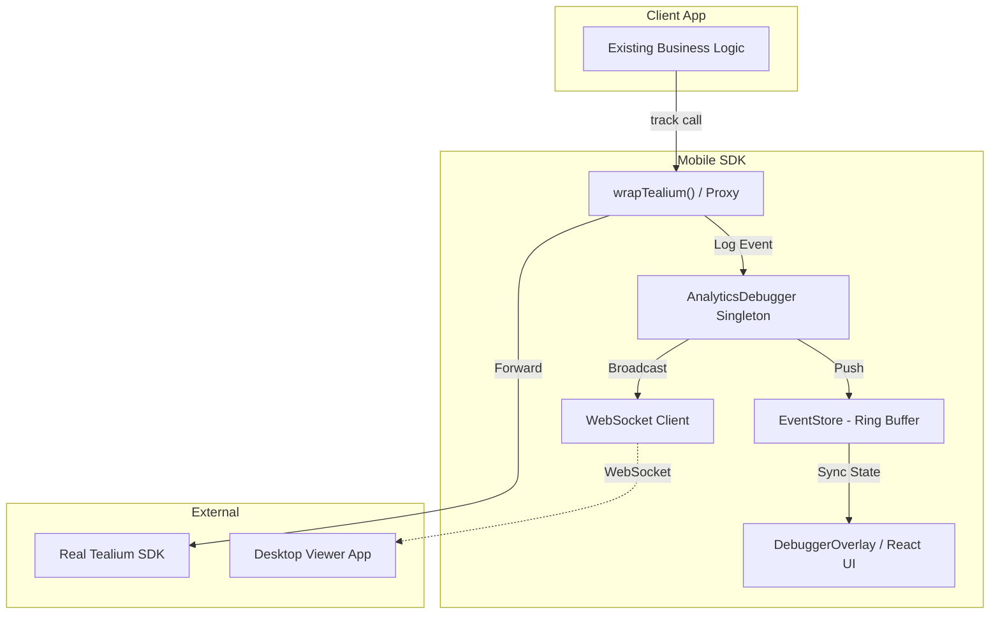

# @mo3ta-dev/rn-analytics-debugger (Mobile SDK)

The internal logic and UI for the React Native Analytics Debugger.

## 🏗 Architecture Overview

The SDK is built on a **Proxy/Adapter pattern** to intercept analytics events without requiring changes to existing business logic.

### High-Level Data Flow

## 📦 Key Components

### 1. `AnalyticsDebugger` (Singleton)
The "Brain" of the SDK. It manages:
- Global configuration (`enabled`, `desktopSync`, etc.)
- The lifecycle of the `EventStore`.
- WebSocket connection to the Desktop App.
- Event broadcasting to subscribers (like the UI).

### 2. `EventStore`
A lightweight in-memory ring buffer that stores up to **1000 events** (configurable). It prevents memory leaks by automatically discarding the oldest events when the capacity is reached.

### 3. `TealiumAdapter` & `wrapTealium`
- **`wrapTealium(instance)`**: Uses a transparent proxy pattern (monkey-patching) to intercept `.track()` calls. This is the recommended way to integrate as it requires **zero changes** to your tracking calls.
- **`TealiumAdapter`**: A class-based alternative that implements the `AnalyticsProvider` interface.

### 4. Mobile UI Components
- **`DebuggerOverlay`**: A floating component that renders on top of the app. It listens to the `AnalyticsDebugger` for status changes.
- **`DebuggerUI`**: The primary dashboard containing the event list and filters.
- **`JSONViewer`**: A recursive component for deep inspection of event payloads.

## 🛠 Tech Stack
- **React Native**: Core UI components.
- **TypeScript**: Full type safety for events and configuration.
- **WebSockets**: Real-time event streaming to the desktop app.
- **Jest**: Unit tested core logic.

## 🔄 Lifecycle
1. **Init**: The debugger is initialized with a config.
2. **Intercept**: Calls to `tealium.track()` are intercepted by the proxy.
3. **Storage**: The event is added to the `EventStore`.
4. **Broadcast**:
   - The Mobile UI re-renders with the new event.
   - If enabled, the event is sent via WebSocket to the Desktop App.
5. **Clear**: Manually clearing logs resets the `EventStore` and updates all connected listeners.
